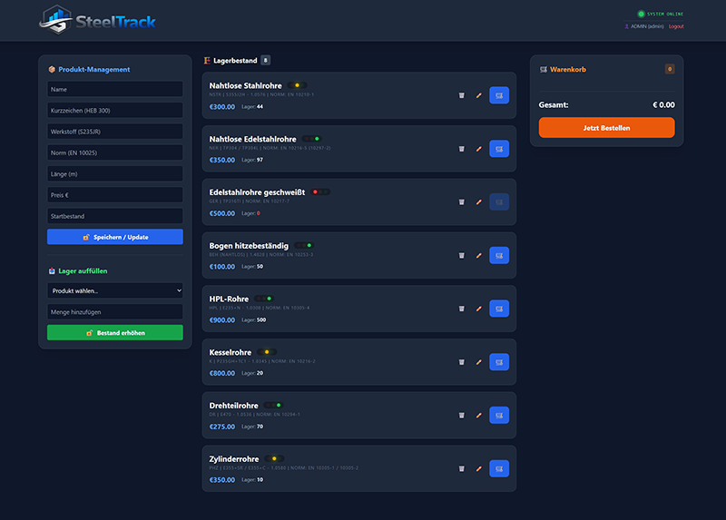

# 🏗️ SteelTrack - Intelligentes Lagerverwaltungssystem

SteelTrack ist eine moderne Full-Stack-Anwendung zur Verwaltung von Stahlprodukten. Das System demonstriert einen hybriden Architektur-Ansatz, der klassische relationale Datenhaltung mit schnellem NoSQL-Logging kombiniert.

## 🚀 Key Features

- **Modernes Dashboard**: Responsives 3-Spalten-Layout mit Tailwind CSS.
- **Echtzeit-Inventar**: Ampel-System (Rot/Gelb/Grün) zur visuellen Lagerstandskontrolle.
- **Hybride Datenspeicherung**:
  - **SQLite (SQLAlchemy)**: Transaktionale Daten für Produkte und Bestellungen.
  - **TinyDB (NoSQL)**: Dokumentenbasiertes Audit-Logging aller Systemaktionen.
- **Rollenbasiertes JWT-System**:
  - **Admin**: Volle Kontrolle (Erstellen, Editieren, Löschen).
  - **Staff**: Berechtigung zur Lagerauffüllung.
  - **Gast**: Öffentlicher Warenkorb und Bestellfunktion.
- **Professionelle Dokumentation**: Automatisierte API-Dokumentation via `pdoc`.


## Screenshot



## 📂 Projektstruktur

```text
steeltrack/
├── backend/
│   ├── app/
│   │   ├── logs/           # Audit-Logging (TinyDB (NoSQL))
│   │   ├── routes/         # API Endpunkte (Products, Orders, Auth)
│   │   ├── services/       # Business Logik (Logger, IRIS-Client)
│   │   ├── auth.py         # JWT & Bcrypt Logik
│   │   ├── main.py         # FastAPI App-Kern & Static Mounting
│   │   ├── database.py     # steeltrack.db engine
│   │   └── models.py       # SQLAlchemy Datenmodelle
│   └── pyproject.toml      # Modernes Dependency Management
├── frontend/
│   ├── images/             # Assets & Logos
│   ├── app.js              # Frontend Logik & Toast-System
│   └── index.html          # Dashboard UI
└── docker-compose.yml      # Infrastruktur (InterSystems IRIS)
```


## 🛠️ Installation & Setup
### 1. Backend vorbereiten
Wechsle in den backend Ordner und erstelle eine virtuelle Umgebung:
```powershell
cd backend
winget install Python.Python.3.12
python -3.12 -m venv venv
.\venv\Scripts\activate
pip install -r requirements.txt
```

### 2. Umgebungsvariablen
Erstelle eine .env Datei im Hauptverzeichnis mit deinen Passwort-Hashes:
```text
STEELTRACK_ADMIN_HASH=$2b$12$...
STEELTRACK_STAFF_HASH=$2b$12$...
```


### 3. Start der Anwendung
Starte den Uvicorn-Server aus dem backend Verzeichnis:
```powershell
uvicorn app.main:app --reload
```
Die Anwendung ist nun unter http://127.0.0.1:8000 erreichbar.


## 📝 Dokumentation generieren
Um die HTML-Dokumentation für das gesamte Projekt zu erstellen:
```powershell
cd .\backend\
venv\Scripts\activate
$env:PYTHONPATH = "backend"
python -m pdoc app -o docs
```

## 🔮 Roadmap: InterSystems IRIS Integration ...